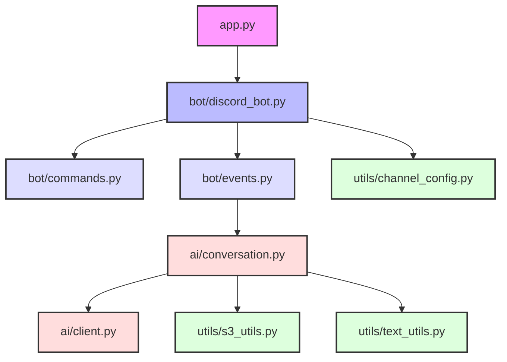

# 🧩 Sphene Discord Bot システムパターン

## システムアーキテクチャ

Sphene Discord Botは、モジュール性と拡張性を重視した構造になっています。主要コンポーネントは次のように分かれています：



### レイヤー構成

1. **エントリーポイント層**
   - `app.py` - アプリケーションのエントリーポイント

2. **ボットコア層**
   - `bot/discord_bot.py` - Discord Botのコア機能とセットアップ
   - `bot/commands.py` - スラッシュコマンド定義
   - `bot/events.py` - Discordイベントハンドラ

3. **AI処理層**
   - `ai/conversation.py` - 会話管理ロジック
   - `ai/client.py` - OpenAI APIクライアント

4. **ユーティリティ層**
   - `utils/channel_config.py` - チャンネル設定管理
   - `utils/s3_utils.py` - S3関連ユーティリティ
   - `utils/text_utils.py` - テキスト処理ユーティリティ

5. **ロギング層**
   - `log_utils/logger.py` - ロギング設定

## 主要コンポーネントと関係

### 1. Botコア (SpheneBot)

**責務**: Discord API接続、コマンド/イベントハンドラ初期化、システムプロンプト読み込み、ライフサイクル管理

**主要メソッド**: `__init__()`, `_setup()`, `run()`

### 2. 会話管理 (Sphene)

**責務**: 会話コンテキスト維持、メッセージ処理、タイムアウト管理、OpenAI API対話、エラーハンドリング、画像処理

**主要メソッド**: `input_message()`, `is_expired()`, `trim_conversation_history()`, `_call_openai_api()`, `_handle_openai_error()`

### 3. システムプロンプト管理

**機能**: キャッシュ機構、ローカル/S3読み込み、フォールバック戦略、エラーハンドリング

**フロー**: キャッシュ確認 → S3/ローカル読み込み（タイプ別） → フォールバック（S3失敗時）→ キャッシュ保存

## デザインパターン

### 1. シングルトンパターン

`user_conversations` 辞書を使用して、ユーザーごとに一意の会話インスタンスを保持します。
これによりユーザー間の会話が混ざることなく、適切に状態を維持できます。

```python
# ユーザーごとの会話インスタンスを保持する辞書
user_conversations: defaultdict[str, Sphene] = defaultdict(
    lambda: Sphene(system_setting=load_system_prompt())
)
```

### 2. ファクトリーパターン

`load_system_prompt` 関数は、ストレージタイプ（ローカルまたはS3）に基づいて適切なプロンプト読み込み処理を選択し、
プロンプトオブジェクトを生成するファクトリーとして機能します。

### 3. ストラテジーパターン

エラーハンドリングでは各エラータイプと対応する処理戦略をマッピングし、
実行時に適切なエラー処理を選択するストラテジーパターンを採用しています。

```python
_OPENAI_ERROR_HANDLERS: dict[Type[APIError], tuple[int, str, str]] = {
    AuthenticationError: (...),
    PermissionDeniedError: (...),
    # 他のエラータイプ
}
```

### 4. デコレータパターン

discord.pyの機能を活用したイベントハンドリングやコマンド処理では、
Pythonのデコレータパターンを使用して宣言的にハンドラを定義しています。

### 5. キャッシュパターン

システムプロンプトのロードでは、キャッシュパターンを使用して
頻繁なファイルIO操作を回避し、パフォーマンスを向上させています。

```python
# プロンプトのキャッシュ
_prompt_cache: dict[str, str] = {}
```

## 重要な実装パス

### 1. メッセージ処理フロー
ユーザーメッセージ → Discord → イベントハンドラ（種別判定） → Sphene（期限確認、メッセージ追加、画像処理） → OpenAI API → 応答履歴追加 → Discord → ユーザー

### 2. コマンド処理フロー
スラッシュコマンド → Discord → コマンドハンドラ（reset/mode/channels/addlist/removelist/clearlist/reload_prompt別処理） → 設定管理/会話管理 → 結果返却

### 3. エラーハンドリングフロー
APIリクエスト → エラー発生 → `_handle_openai_error()`（種別特定、ログ出力） → ユーザー向けメッセージ生成 → 応答

## 拡張性とメンテナンス性

1. **モジュール分割**: 責務別分離、明確なレイヤー間インターフェース
2. **設定管理**: 環境変数、ストレージ抽象化
3. **エラー処理**: 階層的ハンドリング、ユーザーフレンドリーメッセージ、詳細ログ
4. **型安全性**: 型ヒント、明示的型キャスト
5. **テスト容易性**: コンポーネント分離、明確な依存関係
