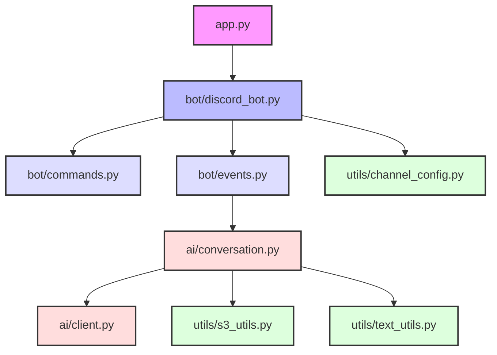
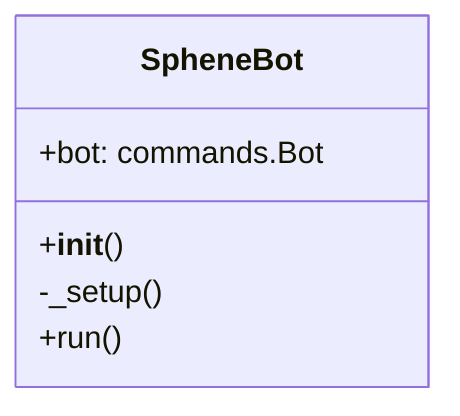
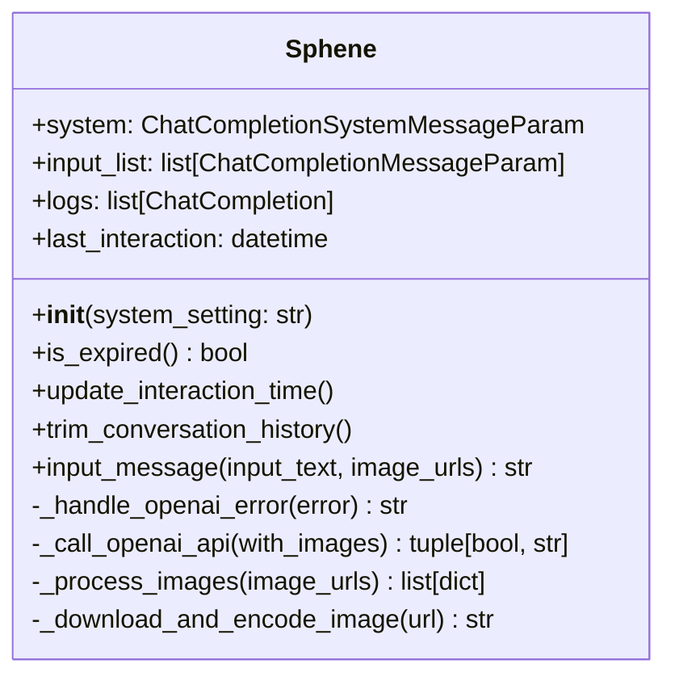
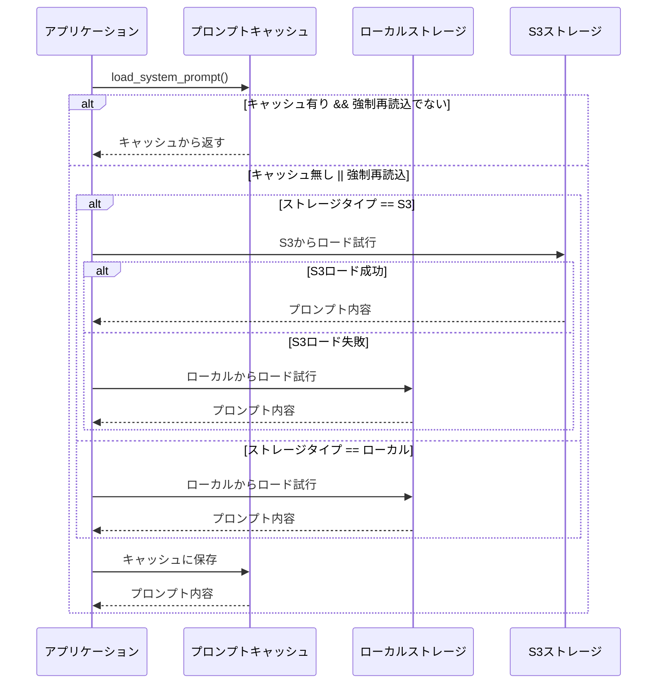
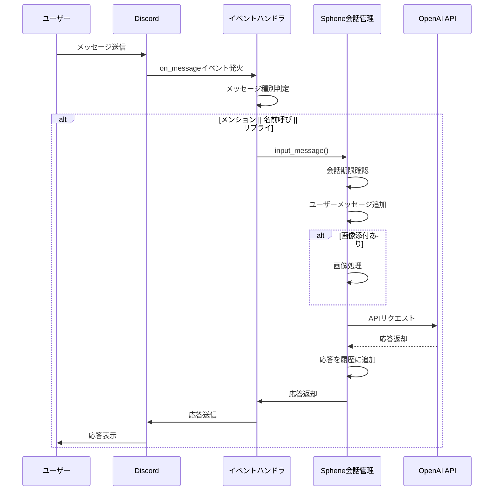
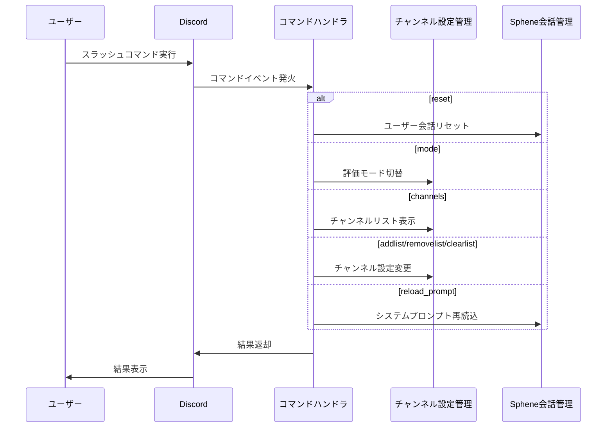
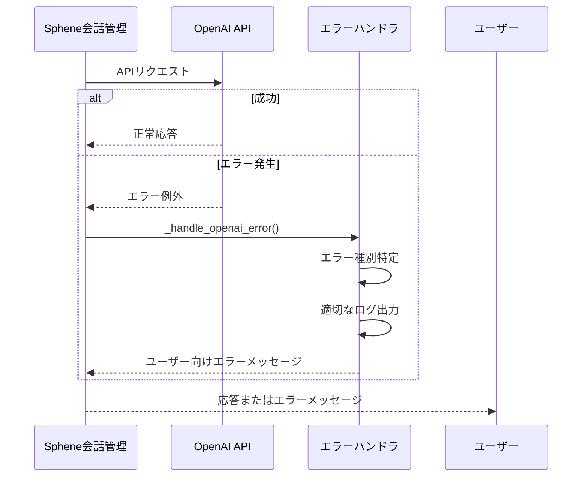

# 🧩 Sphene Discord Bot システムパターン

## システムアーキテクチャ

Sphene Discord Botは、モジュール性と拡張性を重視した構造になっています。主要コンポーネントは次のように分かれています：



### レイヤー構成

1. **エントリーポイント層**
   - `app.py` - アプリケーションのエントリーポイント

2. **ボットコア層**
   - `bot/discord_bot.py` - Discord Botのコア機能とセットアップ
   - `bot/commands.py` - スラッシュコマンド定義
   - `bot/events.py` - Discordイベントハンドラ

3. **AI処理層**
   - `ai/conversation.py` - 会話管理ロジック
   - `ai/client.py` - OpenAI APIクライアント

4. **ユーティリティ層**
   - `utils/channel_config.py` - チャンネル設定管理
   - `utils/s3_utils.py` - S3関連ユーティリティ
   - `utils/text_utils.py` - テキスト処理ユーティリティ

5. **ロギング層**
   - `log_utils/logger.py` - ロギング設定

## 主要コンポーネントと関係

### 1. Botコア (SpheneBot)

SpheneBot クラスはアプリケーションの中心的な役割を果たし、以下の責務を持ちます:

- Discord APIとの接続確立
- コマンドとイベントハンドラの初期化
- システムプロンプトの読み込み検証
- ボットのライフサイクル管理



### 2. 会話管理 (Sphene)

Sphene クラスは会話の状態と履歴を管理し、以下の責務を持ちます:

- 会話コンテキストの維持
- メッセージの処理
- タイムアウト管理
- OpenAI APIとの対話
- エラーハンドリング
- 画像処理



### 3. システムプロンプト管理

システムプロンプトのロード機能は以下のパターンで実装されています:

- キャッシュ機構による効率化
- ローカルファイルとS3からの読み込み
- フォールバック戦略
- エラーハンドリング



## デザインパターン

### 1. シングルトンパターン

`user_conversations` 辞書を使用して、ユーザーごとに一意の会話インスタンスを保持します。
これによりユーザー間の会話が混ざることなく、適切に状態を維持できます。

```python
# ユーザーごとの会話インスタンスを保持する辞書
user_conversations: defaultdict[str, Sphene] = defaultdict(
    lambda: Sphene(system_setting=load_system_prompt())
)
```

### 2. ファクトリーパターン

`load_system_prompt` 関数は、ストレージタイプ（ローカルまたはS3）に基づいて適切なプロンプト読み込み処理を選択し、
プロンプトオブジェクトを生成するファクトリーとして機能します。

### 3. ストラテジーパターン

エラーハンドリングでは各エラータイプと対応する処理戦略をマッピングし、
実行時に適切なエラー処理を選択するストラテジーパターンを採用しています。

```python
_OPENAI_ERROR_HANDLERS: dict[Type[APIError], tuple[int, str, str]] = {
    AuthenticationError: (...),
    PermissionDeniedError: (...),
    # 他のエラータイプ
}
```

### 4. デコレータパターン

discord.pyの機能を活用したイベントハンドリングやコマンド処理では、
Pythonのデコレータパターンを使用して宣言的にハンドラを定義しています。

### 5. キャッシュパターン

システムプロンプトのロードでは、キャッシュパターンを使用して
頻繁なファイルIO操作を回避し、パフォーマンスを向上させています。

```python
# プロンプトのキャッシュ
_prompt_cache: dict[str, str] = {}
```

## 重要な実装パス

### 1. メッセージ処理フロー



### 2. コマンド処理フロー



### 3. エラーハンドリングフロー



## 拡張性とメンテナンス性

1. **モジュール分割**
   - 責務ごとに適切に分離されたモジュール構造
   - 各レイヤー間の明確なインターフェース

2. **設定管理**
   - 環境変数を使用した外部設定
   - ストレージオプションの抽象化

3. **エラー処理**
   - 階層的なエラーハンドリング
   - ユーザーフレンドリーなエラーメッセージ
   - 詳細なログ記録

4. **型安全性**
   - Pythonの型ヒントを活用
   - 明示的な型キャスト

5. **テスト容易性**
   - 適切に分離されたコンポーネント
   - 依存関係の明確な構造
