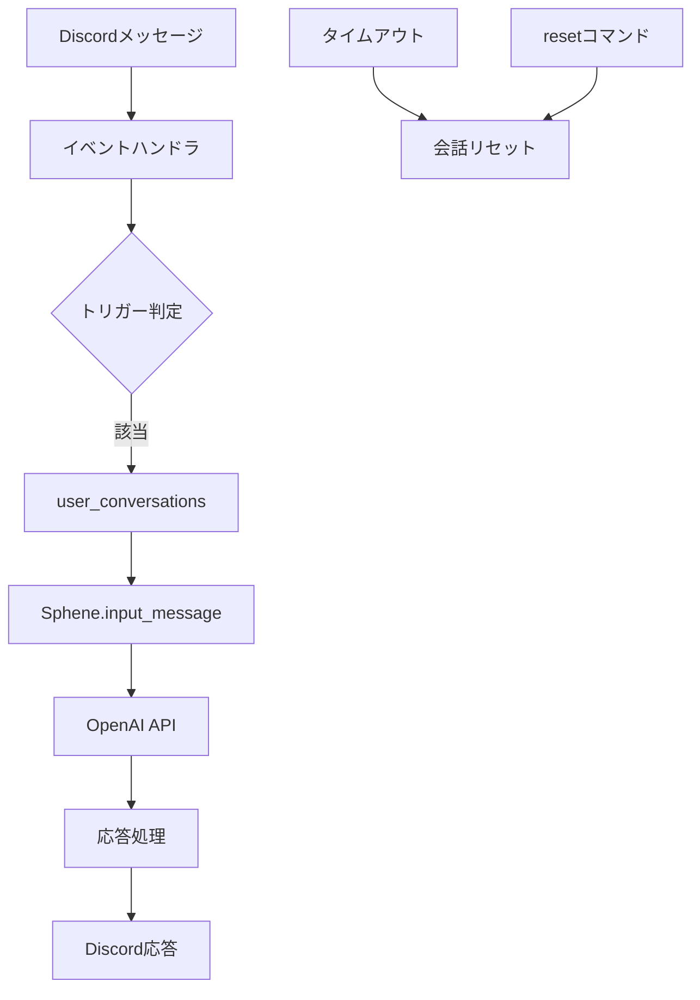

# 🔧 Sphene Discord Bot 技術コンテキスト

## 技術スタック

### コア技術

- **プログラミング言語**: Python 3.13+
- **Discord連携**: discord.py
- **AI機能**: OpenAI API (GPT-4o-mini)
- **設定管理**: dotenv
- **コンテナ化**: Docker
- **オーケストレーション**: Kubernetes (オプション)
- **クラウドストレージ**: AWS S3 (オプション)

### 依存パッケージ

主要な依存パッケージは以下の通りです（詳細は`requirements.txt`参照）:

```
discord.py
openai
python-dotenv
boto3 (S3使用時)
```

### 代替可能なコンポーネント

- **ストレージ**: ローカルファイルシステム ⟷ AWS S3
- **デプロイ方法**: ローカル実行 ⟷ Docker ⟷ Kubernetes
- **AIモデル**: GPT-4o-mini ⟷ 他のOpenAIモデル

## 開発環境

### 必要条件

- Python 3.13以上
- OpenAI APIキー
- Discord開発者アカウントとボットトークン
- （オプション）AWS認証情報（S3使用時）

### ローカル開発環境セットアップ

1. リポジトリのクローン
2. 依存パッケージのインストール: `pip install -r requirements.txt`
3. `.env`ファイルの設定
4. アプリケーションの実行: `python app.py`

### 開発・検証用コマンド

詳細は[CLAUDE.md](../../../CLAUDE.md)の「Commands for Development」参照。

## 技術的制約

### パフォーマンス

- OpenAI APIの応答時間に依存
- Discordレート制限への考慮が必要
- 会話履歴は一定の長さに制限（MAX_CONVERSATION_TURNS = 10）
- 会話履歴は30分のタイムアウトで期限切れ

### スケーラビリティ

- Discord APIの接続制限
- OpenAI APIの利用制限とコスト
- ボット1インスタンスあたりのDiscordサーバー数制限

### セキュリティ

- APIキーと認証情報の適切な管理
- 環境変数またはKubernetes Secretsでの秘密情報保護
- チャンネル制限による使用範囲の制御

## 設定メカニズム

### 環境変数

主要な設定は環境変数で管理されています:

```
OPENAI_API_KEY=your_openai_api_key
DISCORD_TOKEN=your_discord_bot_token
BOT_NAME=スフェーン  # ボットの呼び名
COMMAND_GROUP_NAME=sphene  # コマンドグループ名
OPENAI_MODEL=gpt-4o-mini  # 使用するOpenAIのモデル

# システムプロンプトの設定
SYSTEM_PROMPT_FILENAME=system.txt
# プロンプトのストレージタイプ: local または s3
PROMPT_STORAGE_TYPE=local
# S3バケット名（PROMPT_STORAGE_TYPE=s3 の場合）
S3_BUCKET_NAME=your-bucket-name
# S3フォルダパス（オプション）
S3_FOLDER_PATH=prompts

# チャンネル設定の保存先: local または s3
CHANNEL_CONFIG_STORAGE_TYPE=local
# チャンネル設定ファイルのパス（ローカルの場合）
CHANNEL_CONFIG_PATH=channel_config.json

# 使用を禁止するチャンネルIDをカンマ区切りで指定
DENIED_CHANNEL_IDS=
```

### ストレージ設定

システムプロンプトとチャンネル設定は、ローカルまたはS3に保存可能です:

1. **ローカルストレージ**
   - システムプロンプト: `storage/system.txt`
   - チャンネル設定: `channel_config.json`

2. **S3ストレージ**
   - 指定されたS3バケットとフォルダパスに保存
   - 認証はAWS標準認証メカニズムを使用

## デプロイメントモデル

**ローカル**: `python app.py`

**Docker**: イメージビルド → コンテナ実行（--env-file使用）

**Kubernetes**: Secret作成（環境変数、レジストリ認証）→ デプロイメント適用

詳細コマンドは[CLAUDE.md](../../../CLAUDE.md)参照。

## データフロー

### 設定データフロー
`.env` → `config.py` → アプリケーションコンポーネント
`system.txt/S3` → `load_system_prompt` → Sphene会話インスタンス
`channel_config.json/S3` → チャンネル設定管理 → イベントハンドラ

### 会話データフロー


### エラー処理フロー
API呼び出し → エラー発生 → エラータイプ判定 → ログ記録 → ユーザーフレンドリーメッセージ → Discord応答

## テスト戦略

**構造**: tests/ (test_ai/, test_bot/, test_utils/)

**種別**: ユニットテスト（モック使用）、統合テスト（連携検証）

**実行**: pytest、`run_tests.sh`、CI/CD連携

## パフォーマンス最適化

1. プロンプトキャッシング
2. 会話履歴管理（自動削除、期限切れ）
3. エラー処理戦略（リトライ、フォールバック）
4. チャンネル制限（API呼び出し削減）

## 技術的負債と将来拡張

**技術的負債**: Dockerfile最適化、K8s構成詳細設計、カバレッジ拡大、認証管理強化

**将来拡張**: マルチモデル、Web管理UI、分析/監視、チャンネル固有プロンプト、他プラットフォーム対応
