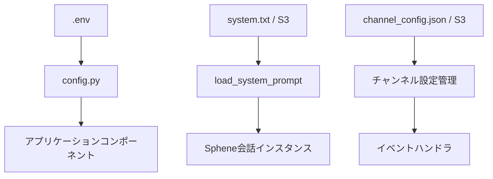
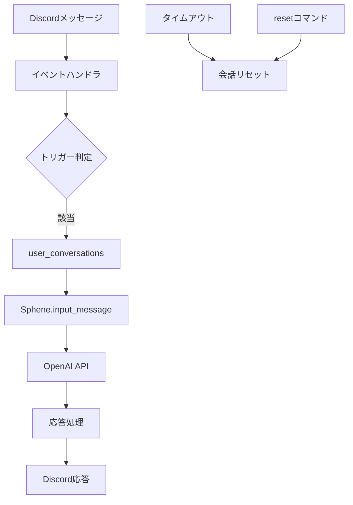
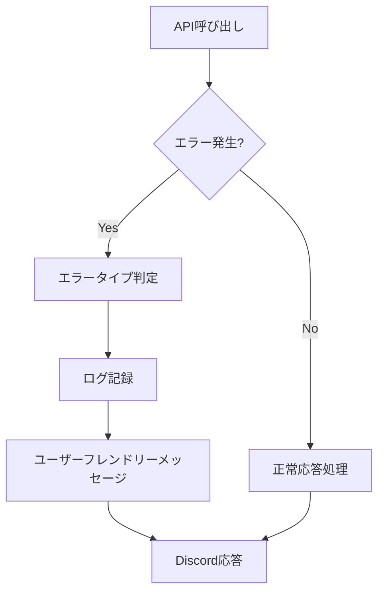

# 🔧 Sphene Discord Bot 技術コンテキスト

## 技術スタック

### コア技術

- **プログラミング言語**: Python 3.13+
- **Discord連携**: discord.py
- **AI機能**: OpenAI API (GPT-4o-mini)
- **設定管理**: dotenv
- **コンテナ化**: Docker
- **オーケストレーション**: Kubernetes (オプション)
- **クラウドストレージ**: AWS S3 (オプション)

### 依存パッケージ

主要な依存パッケージは以下の通りです（詳細は`requirements.txt`参照）:

```
discord.py
openai
python-dotenv
boto3 (S3使用時)
```

### 代替可能なコンポーネント

- **ストレージ**: ローカルファイルシステム ⟷ AWS S3
- **デプロイ方法**: ローカル実行 ⟷ Docker ⟷ Kubernetes
- **AIモデル**: GPT-4o-mini ⟷ 他のOpenAIモデル

## 開発環境

### 必要条件

- Python 3.13以上
- OpenAI APIキー
- Discord開発者アカウントとボットトークン
- （オプション）AWS認証情報（S3使用時）

### ローカル開発環境セットアップ

1. リポジトリのクローン
2. 依存パッケージのインストール: `pip install -r requirements.txt`
3. `.env`ファイルの設定
4. アプリケーションの実行: `python app.py`

### 開発・検証用コマンド

```bash
# 依存関係のインストール
pip install -r requirements.txt

# 開発用依存関係のインストール
pip install -r requirements-dev.txt

# テストの実行
pytest

# テスト実行スクリプト
./run_tests.sh

# 静的解析
mypy .

# コードフォーマット
black .
```

## 技術的制約

### パフォーマンス

- OpenAI APIの応答時間に依存
- Discordレート制限への考慮が必要
- 会話履歴は一定の長さに制限（MAX_CONVERSATION_TURNS = 10）
- 会話履歴は30分のタイムアウトで期限切れ

### スケーラビリティ

- Discord APIの接続制限
- OpenAI APIの利用制限とコスト
- ボット1インスタンスあたりのDiscordサーバー数制限

### セキュリティ

- APIキーと認証情報の適切な管理
- 環境変数またはKubernetes Secretsでの秘密情報保護
- チャンネル制限による使用範囲の制御

## 設定メカニズム

### 環境変数

主要な設定は環境変数で管理されています:

```
OPENAI_API_KEY=your_openai_api_key
DISCORD_TOKEN=your_discord_bot_token
BOT_NAME=スフェーン  # ボットの呼び名
COMMAND_GROUP_NAME=sphene  # コマンドグループ名
OPENAI_MODEL=gpt-4o-mini  # 使用するOpenAIのモデル

# システムプロンプトの設定
SYSTEM_PROMPT_FILENAME=system.txt
# プロンプトのストレージタイプ: local または s3
PROMPT_STORAGE_TYPE=local
# S3バケット名（PROMPT_STORAGE_TYPE=s3 の場合）
S3_BUCKET_NAME=your-bucket-name
# S3フォルダパス（オプション）
S3_FOLDER_PATH=prompts

# チャンネル設定の保存先: local または s3
CHANNEL_CONFIG_STORAGE_TYPE=local
# チャンネル設定ファイルのパス（ローカルの場合）
CHANNEL_CONFIG_PATH=channel_config.json

# 使用を禁止するチャンネルIDをカンマ区切りで指定
DENIED_CHANNEL_IDS=
```

### ストレージ設定

システムプロンプトとチャンネル設定は、ローカルまたはS3に保存可能です:

1. **ローカルストレージ**
   - システムプロンプト: `storage/system.txt`
   - チャンネル設定: `channel_config.json`

2. **S3ストレージ**
   - 指定されたS3バケットとフォルダパスに保存
   - 認証はAWS標準認証メカニズムを使用

## デプロイメントモデル

### ローカル実行

最もシンプルなデプロイメント方法:

```bash
python app.py
```

### Docker

コンテナ化されたデプロイメント:

```bash
# イメージのビルド
docker build -t sphene-discord-bot .

# コンテナの実行
docker run --env-file .env sphene-discord-bot
```

### Kubernetes

高可用性デプロイメント:

1. 環境変数をKubernetes Secretとして作成:
   ```bash
   kubectl create secret generic sphene-envs --from-env-file ./.env
   ```

2. GitHub Container Registry認証用Secretの作成:
   ```bash
   kubectl create secret docker-registry regcred --docker-server=ghcr.io --docker-username=<GitHubユーザー名> --docker-password=<GitHubトークン>
   ```

3. デプロイメントとサービス定義の適用

## データフロー

### 設定データフロー



### 会話データフロー



### エラー処理フロー



## テスト戦略

### テスト構造

```
tests/
├── __init__.py
├── conftest.py
├── test_ai/
│   ├── __init__.py
│   ├── test_client.py
│   └── test_conversation.py
├── test_bot/
│   ├── __init__.py
│   ├── test_channel_commands.py
│   ├── test_commands.py
│   ├── test_discord_bot.py
│   ├── test_events.py
│   └── test_reactions.py
└── test_utils/
    ├── __init__.py
    ├── test_channel_config.py
    ├── test_channel_id_handling.py
    ├── test_channel_speak.py
    ├── test_logger.py
    └── test_text_utils.py
```

### テスト種別

1. **ユニットテスト**
   - 個別コンポーネントの機能検証
   - モックを使用した外部依存の分離

2. **統合テスト**
   - コンポーネント間の連携検証
   - データの受け渡しの正確性

### テスト実行環境

- pytest フレームワーク
- 実行スクリプト: `run_tests.sh`
- CI/CD連携（設定に応じて）

## パフォーマンス最適化

1. **プロンプトキャッシング**
   - システムプロンプトのメモリ内キャッシング

2. **会話履歴管理**
   - 一定ターン数以上の古い履歴を自動削除
   - 会話の期限切れ機構

3. **エラー処理戦略**
   - 適切なリトライと適切なフォールバック

4. **チャンネル制限**
   - 使用可能チャンネルの制限によるAPI呼び出し削減

## テクニカルデット（技術的負債）

- Dockerfileの最適化余地
- Kubernetes構成の詳細設計
- コードカバレッジの拡大
- 認証情報管理の強化
- エラーハンドリングのさらなる改善

## 将来的な技術拡張の可能性

1. **マルチモデルサポート**
   - 複数のAIモデルを状況に応じて使い分け

2. **ウェブインターフェース**
   - 管理者用のダッシュボード

3. **分析と監視**
   - 使用統計の収集と可視化
   - パフォーマンス監視

4. **チャンネル固有のパーソナライズ**
   - チャンネルごとにカスタムプロンプト

5. **他のコミュニケーションプラットフォームへの拡張**
   - SlackやTeamsなどへの対応
